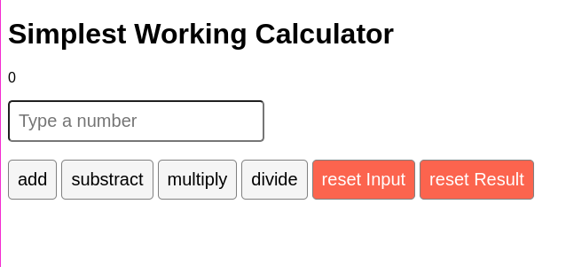

# Simple Calculator

Simple Calculator is a lightweight, user-friendly calculator application built using React.js. It provides basic arithmetic operations such as addition, subtraction, multiplication, and division, and is designed to be easy to use and understand.
It was built as the final project for [Meta's React Basics course on Coursera](https://www.coursera.org/learn/react-basics). 



## Table of Contents
- [Features]()
- [Getting Started](#getting-started)
  - [Prerequisites](#prerequisites)
  - [Installation](#installation)
- [Running the Project](#running-the-project)
- [Resources](#resources)
- [Contributing](#contributing)
- [License](#license)
- [Support](#support)

## Features

- Four basic arithmetic operations: addition, subtraction, multiplication, and division
- Supports integers 
- Responsive design for different screen sizes

## Getting Started

Follow these steps to set up the project locally.

### Prerequisites

Before getting started, make sure you have the following software installed on your system:

- [Node.js](https://nodejs.org/en/) 

This project was built using Node.js v18.14.0. If you use [NVM](https://github.com/nvm-sh/nvm), you can run `nvm use` to switch to the correct version.


### Installation

1. [Fork](https://docs.github.com/en/get-started/quickstart/fork-a-repo) and clone this repository:
```bash
git clone https://github.com/<your username>/Simple-Calculator.git
```

2. Change the current directory to the project folder and install the dependencies:
```bash
cd Simple-Calculator
npm ci 
```

## Running the Project

Start the development server:

```bash
npm run start 
```
Now, open your browser and navigate to [http://localhost:3000](http://localhost:3000) to view the project.

## Usage

1. Use the on-screen buttons "add", "subtract", "multiply", "divide" to perform calculations on the previous result (or 0 for the first calculation).
2. Use the on-screen buttons "reset Input" and "reset Result" to clear the input and result fields, respectively.  

## Resources

- [React.js](https://reactjs.org/)
- [Meta's React Basics course on Coursera](https://www.coursera.org/learn/react-basics)
- The React Basics course is part of the [Meta Front-End Developer Professional Certificate](https://www.coursera.org/professional-certificates/meta-front-end-developer). It is a 9-course program that covers HTML, CSS, JavaScript, React, Git, and more.


## Contributing

Contributions are always welcome! If you'd like to contribute to this project or have any suggestions, feel free to create a new issue or submit a pull request. Please check the [Code of Conduct](./CODE_OF_CONDUCT.md) first.

To submit a pull request, follow these steps:
1. Fork the repository
2. Create your feature branch (`git checkout -b feature/your-feature-name`)
3. Commit your changes (`git commit -am 'Add some feature'`)
4. Push to the branch (`git push origin feature/your-feature-name`)
5. Create a new Pull Request

## License

This project is open-source and available under the [MIT License](./LICENSE.md).

## Support
If you have any questions or need help getting started, please open an issue in the repository or contact me on Twitter: @tanja_codes